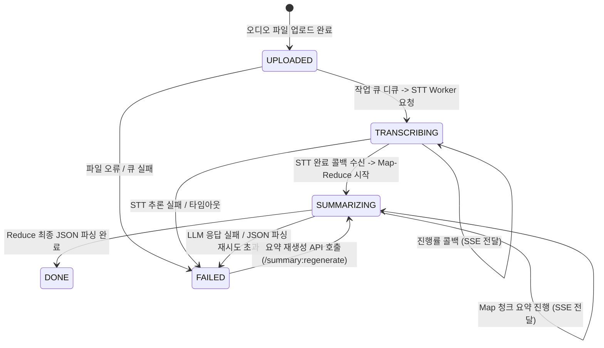
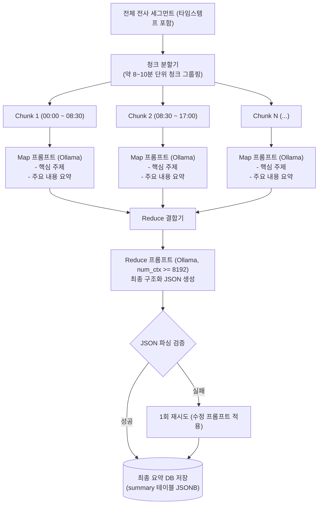

# LectureNote AI System Architecture

LectureNote AI는 온디바이스(로컬 GPU) 기반의 음성 전사(STT) 및 AI 강의 요약 웹 서비스입니다.  
외부 상용 API 호출 없이 로컬 PC(NVIDIA GPU)에서 전사 및 요약 처리를 완결하며, 단일 작업 큐를 통해 한정된 GPU VRAM 자원을 안정적으로 활용합니다.

---

## 1. 시스템 구성도

```mermaid
graph TD
    User["사용자 웹 브라우저 (React + Vite)"]
    
    subgraph Host["Local Host (NVIDIA RTX 3070 8GB)"]
        subgraph FrontendApp["Frontend (:5173)"]
            ReactUI["React + Vite + TS\n(TanStack Query, react-router)"]
        end

        subgraph BackendApp["Backend (:8080)"]
            SpringBoot["Spring Boot 3 (Java 21)\n- Upload Controller\n- Single Thread Job Queue\n- SSE Emitter\n- Summary Pipeline (Spring AI)"]
        end

        subgraph Infra["인프라 컨테이너 (:5432)"]
            Postgres[("PostgreSQL 16\n(Docker Compose)")]
        end

        subgraph Workers["Local AI Services"]
            STTWorker["STT Worker (:8000)\nFastAPI + faster-whisper\n(CUDA, float16)"]
            Ollama["Ollama Engine (:11434)\n(e.g., exaone3.5:2.4b / gemma3:4b)\nnum_ctx >= 8192"]
        end

        Storage[("공유 볼륨\n./storage/audio")]
    end

    User -->|HTTP REST / SSE| ReactUI
    ReactUI -->|REST API / SSE Events| SpringBoot
    SpringBoot -->|JPA / JDBC| Postgres
    SpringBoot -->|파일 저장/스트리밍| Storage
    STTWorker -->|오디오 파일 읽기| Storage
    SpringBoot -->|POST /transcribe (비동기 요청)| STTWorker
    STTWorker -->|POST /internal/stt/callback (진행률/완료/에러)| SpringBoot
    SpringBoot -->|Spring AI Prompt/JSON 요청| Ollama
```

---

## 2. 핵심 컴포넌트 역할

| 컴포넌트 | 기술 스택 | 주요 역할 |
|---|---|---|
| **frontend** | React 18+, Vite, TypeScript, Tailwind CSS, TanStack Query | - 강의 파일 업로드 (드래그 앤 드롭)<br>- 강의 목록 및 상태 모니터링 (실시간 SSE 반영)<br>- 오디오 플레이어 & 전사 텍스트 타임스탬프 동기화<br>- 구조화된 요약 및 퀴즈 탭 뷰 제공 |
| **backend** | Spring Boot 3, Java 21, Gradle, Spring Data JPA, Spring AI | - 메인 비즈니스 서버<br>- 파일 업로드 및 오디오 Range 스트리밍<br>- 단일 스레드 작업 큐 (GPU VRAM 보호)<br>- STT Worker 비동기 호출 및 콜백 수신<br>- Map-Reduce 요약 파이프라인 (Spring AI - Ollama 연동)<br>- 클라이언트 실시간 SSE 이벤트 브로드캐스트 |
| **stt-worker** | Python 3.13, FastAPI, faster-whisper (CTranslate2) | - faster-whisper(`large-v3-turbo`, CUDA, float16) 기반 STT<br>- VAD(`vad_filter=True`) 기반 잡음 제거 및 한국어 전사<br>- 오디오 처리 시간 비율 기반 진행률 계산 및 콜백 전송 |
| **Ollama** | Ollama, 로컬 언어모델 (EXAONE-3.5 2.4B / Gemma-3 4B) | - 온디바이스 로컬 LLM 추론<br>- Map-Reduce 요약 및 JSON 스키마 기반 출력 (`num_ctx >= 8192`) |
| **PostgreSQL** | PostgreSQL 16 (docker-compose) | - 강의 메타데이터, 상태, 전사 세그먼트, 요약 결과 영속화 |

---

## 3. 처리 라이프사이클 및 상태 전이



---

## 4. 비동기 STT & 콜백 프로토콜

### 4.1 작업 요청 (`Spring Boot` ➔ `STT Worker`)
- **Endpoint**: `POST http://localhost:8000/transcribe`
- **Request Body**:
  ```json
  {
    "lectureId": 1,
    "audioPath": "./storage/audio/uuid-sample.mp3",
    "callbackUrl": "http://localhost:8080/internal/stt/callback",
    "language": "ko"
  }
  ```
- **Response**: `202 Accepted` 즉시 응답 후 BackgroundTasks 실행.

### 4.2 콜백 전송 (`STT Worker` ➔ `Spring Boot`)
- **Endpoint**: `POST http://localhost:8080/internal/stt/callback`
- **인증 헤더**: `X-STT-Token: <STT_SHARED_SECRET>`
- **Payload 스키마**:
  ```json
  {
    "lectureId": 1,
    "status": "PROGRESS | COMPLETED | FAILED",
    "progress": 45,
    "errorMessage": null,
    "segments": [
      {
        "seq": 0,
        "startMs": 0,
        "endMs": 3200,
        "text": "안녕하세요. 오늘 강의를 시작하겠습니다."
      }
    ]
  }
  ```

---

## 5. Map-Reduce 요약 파이프라인

GPU VRAM 및 컨텍스트 길이 효율화를 위해 2단계 Map-Reduce 구조를 사용합니다.



### 최종 요약 JSON 스키마
```json
{
  "overview": "강의 전체의 3~5문장 핵심 요약",
  "sections": [
    {
      "title": "섹션 소제목",
      "startMs": 0,
      "endMs": 480000,
      "points": [
        "섹션 내 핵심 정리 포인트 1",
        "섹션 내 핵심 정리 포인트 2"
      ]
    }
  ],
  "keywords": ["키워드1", "키워드2", "키워드3"],
  "examQuestions": [
    {
      "q": "강의 내용 기반 예상 시험 질문",
      "a": "모범 답안 및 상세 해설"
    }
  ]
}
```

---

## 6. 데이터베이스 스키마 (PostgreSQL)

```sql
-- 강의 메타데이터
CREATE TABLE lecture (
    id BIGSERIAL PRIMARY KEY,
    title VARCHAR(255) NOT NULL,
    audio_path VARCHAR(500) NOT NULL,
    duration_ms BIGINT DEFAULT 0,
    status VARCHAR(30) NOT NULL, -- UPLOADED, TRANSCRIBING, SUMMARIZING, DONE, FAILED
    progress INT DEFAULT 0,
    error_message TEXT,
    created_at TIMESTAMP WITH TIME ZONE DEFAULT CURRENT_TIMESTAMP,
    updated_at TIMESTAMP WITH TIME ZONE DEFAULT CURRENT_TIMESTAMP
);

-- 전사 세그먼트 (타임스탬프 동기화용)
CREATE TABLE transcript_segment (
    id BIGSERIAL PRIMARY KEY,
    lecture_id BIGINT NOT NULL REFERENCES lecture(id) ON DELETE CASCADE,
    seq INT NOT NULL,
    start_ms BIGINT NOT NULL,
    end_ms BIGINT NOT NULL,
    text TEXT NOT NULL
);
CREATE INDEX idx_transcript_lecture_seq ON transcript_segment(lecture_id, seq);

-- 요약 결과 (CHUNK 요약 및 최종 FINAL 구조화 요약)
CREATE TABLE summary (
    id BIGSERIAL PRIMARY KEY,
    lecture_id BIGINT NOT NULL REFERENCES lecture(id) ON DELETE CASCADE,
    kind VARCHAR(20) NOT NULL, -- CHUNK, FINAL
    chunk_index INT,
    content JSONB NOT NULL,
    model VARCHAR(100) NOT NULL,
    created_at TIMESTAMP WITH TIME ZONE DEFAULT CURRENT_TIMESTAMP
);
CREATE INDEX idx_summary_lecture_kind ON summary(lecture_id, kind);
```

---

## 7. 백엔드 API 명세 (Spring Boot)

| HTTP Method | Path | 파라미터 / 바디 | 설명 |
|---|---|---|---|
| `POST` | `/api/lectures` | `multipart/form-data` (`file`, `title`) | 강의 업로드 (상태 `UPLOADED`, 큐 적재, `202 Accepted` 반환) |
| `GET` | `/api/lectures` | - | 전체 강의 목록 및 진행 상태 조회 |
| `GET` | `/api/lectures/{id}` | - | 특정 강의 상세 정보 (status, progress 등) |
| `GET` | `/api/lectures/{id}/transcript` | - | 세그먼트 목록 (startMs, endMs, text) 조회 |
| `GET` | `/api/lectures/{id}/summary` | - | 최종 요약 JSON 조회 |
| `GET` | `/api/lectures/{id}/events` | SSE (`text/event-stream`) | 강의 진행률 및 상태 변경 실시간 스트리밍 |
| `GET` | `/api/lectures/{id}/audio` | HTTP Range Header | 오디오 스트리밍 (시크바 탐색 지원) |
| `POST` | `/api/lectures/{id}/summary:regenerate` | `{ "model": "optional" }` | 기존 전사 결과를 바탕으로 요약 재실행 |
| `DELETE` | `/api/lectures/{id}` | - | 강의 메타데이터, 세그먼트, 요약, 오디오 파일 삭제 |
| `POST` | `/internal/stt/callback` | JSON payload + `X-STT-Token` | STT 워커 전사 완료/진행 콜백 수신 |

---

## 8. GPU VRAM 관리 및 동시성 제어
1. **단일 스레드 작업 큐 (Single Thread Queue)**:
   - Spring Boot 내 `ThreadPoolTaskExecutor(core=1, max=1, queueCapacity=100)`를 적용하여 STT 작업 및 LLM 요약 작업을 한 번에 1개씩 순차 처리합니다.
2. **STT ➔ LLM 순차 파이프라인**:
   - STT Worker 추론이 완료되어 GPU 메모리 점유가 낮아진 후 Ollama LLM 추론을 시작하므로 8GB VRAM(RTX 3070) 내에서 OOM 위험 없이 안전하게 구동됩니다.
